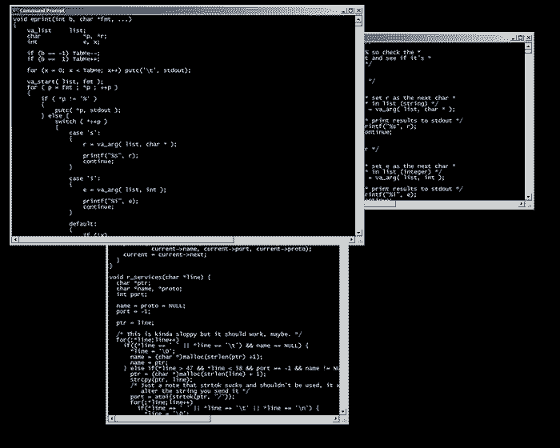

<h2 align="left">Antonio Cleison</h2>

Estudante de Análise e Desenvolvimento de Sistemas na Universidade Estadual do Maranhão. Estou constantemente atualizando meus conhecimentos e buscando novos desafios na área, tenho focado no aprendizado e desenvolvimento em backend com Java. 

  
#

<h3 align="left">Contato: </h3>

<h3 align="left">Linguagens e Tecnologias: </h3>

   
  
  
  
  
  
  
  
  
  
  
  

#
<h3>Estatísticas: </h3>

