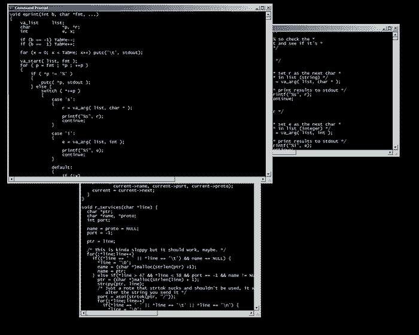

<!-- <div>
<a href="https://git.io/typing-svg"></a>
</div>
[+💻;Sempre+aprendendo+algo+novo+;Java+Spring+Boot+Developer)](https://git.io/typing-svg)
<h2 align="left">Antonio Cleison</h2>
-->


``` json
{
    "name": "Antonio Cleison",
    "username": "Attonic",
    "title": "Desenvolvedor",
    "focus": "Spring Boot",
    "location": "Brasil",
    "learning": "Java e Spring Boot"
}
```

<table border="0" width="100%">
  <tr style="border: none;">
    <td width="300px" style="border: none; padding-right: 20px;">
<pre>
  █▀█ ▀█▀ ▀█▀ █▀█ █▄ █ █ ▄▀▀
  █▀█  █   █  █▄█ █ ▀█ █ ▀▄▄
</pre>
    </td>
    <!-- Texto -->
    <td style="border: none; vertical-align: middle;">
      <strong>Desenvolvedor Back-End Java</strong><br>
      Análise e Desenvolvimento de Sistemas - Universidade Estadual do Maranhão<br>
      Técnico em Informática - Instituto Federal do Sul de Minas
    </td>
  </tr>
</table>


<div>  
         <p align="center">“Conhecereis a verdade, e a verdade vos libertará.”
   
</div>
  
#



<h3 align="left">Contato: </h3>


<a href="https://www.linkedin.com/in/antoniocleison/">
  
</a>

<a href="mailto:codeacle@gmail.com">
  
</a>


<h3 align="left">Linguagens e Tecnologias: </h3>


###
[](https://skillicons.dev)

###


  


#


---


###


